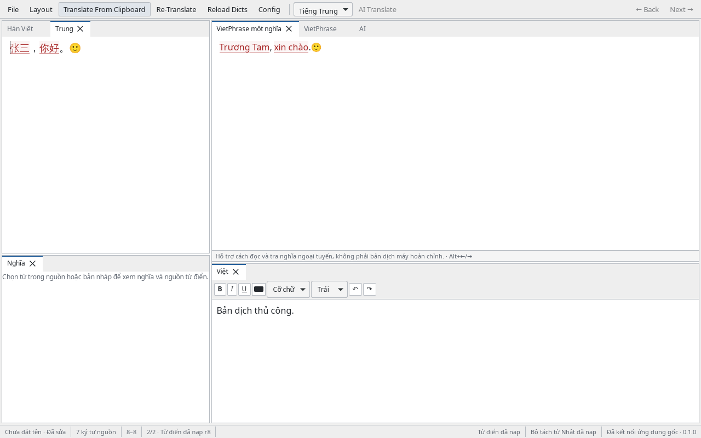
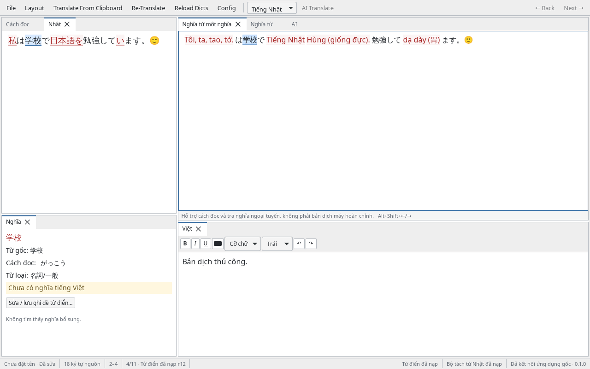

<p align="center">
  
</p>

<p align="center">
  <strong>A local-first desktop workspace for reading, reviewing, and writing Vietnamese.</strong><br />
  Offline dictionary assistance. A manual editor you control. Optional AI when you choose to send.
</p>

<p align="center">
  <a href="https://github.com/KNN-07/QuickerTranslator/actions/workflows/desktop.yml"></a>
  <a href="https://v2.tauri.app/"></a>
  <a href="https://react.dev/"></a>
  <a href="https://www.rust-lang.org/"></a>
</p>

<p align="center">
  <a href="#features">Features</a> ·
  <a href="#get-the-app">Get the app</a> ·
  <a href="#your-first-document">Quick start</a> ·
  <a href="#optional-ai-translation">AI translation</a> ·
  <a href="#build-from-source">Build from source</a>
</p>

---

## The workspace

Keep the source, readings, dictionary meanings, phrase draft, and your Vietnamese text together in a compact, resizable desktop layout. Vietnamese is the output language; the interface supports Vietnamese and English, with light and dark themes.



*Actual native application capture using an imported sample dictionary. Red matched text links source words to generated output; the manual Vietnamese draft stays separate.*

> **Offline assistance is not fluent machine translation.** Chinese phrase lookups and Japanese readings/glosses help you review vocabulary. Missing entries stay visible rather than receiving invented translations.

## Features

| | What you can do |
|---|---|
| **Chinese dictionary workflow** | Review VietPhrase alternatives, Hán Việt readings, primary/secondary names, Luật Nhân rules, and ignored phrases. Choose among three matching algorithms and wrapping options. |
| **Separate Japanese processing** | Use embedded IPADIC segmentation, hiragana readings, base forms, and part of speech. Match custom phrases on token boundaries, then look up surface → lemma → reading. |
| **Aligned review** | Click a generated word to inspect its source, ordered meanings, and provenance. Choose alternatives or reorder first-meaning tokens with pointer dragging or the keyboard. |
| **Your Vietnamese draft** | Write and format text in the manual editor. Insert a chosen meaning at the retained caret as one undoable edit. Source edits and dictionary reloads never replace your draft automatically. |
| **Optional AI** | Translate a selection or document, or improve selected Vietnamese, using OpenAI, Gemini, Anthropic, or a compatible custom endpoint. Review the payload before sending. |
| **Local dictionaries** | Import existing corpora, preview encoding and malformed records, edit entries, keep history, and preserve overrides/deletions across reloads. User corpora remain local. |
| **Documents and exports** | Save native `.qtp` projects, migrate legacy `.qt` files, recover unsaved work, and export TXT, HTML, or DOCX with ordered columns. |
| **A familiar desktop** | Resize and dock tabs, hide/show panes, reset layout, adjust fonts/wrapping, and use legacy traversal keys, nine snippets, and typed-only shortcuts. |

<details>
<summary><strong>See Japanese readings and unknown-word handling</strong></summary>



*An actual native capture with bundled data: 学校 exposes reading がっこう while its missing Vietnamese gloss is explicitly reported. The recorded sample had glosses for 4 of 11 lexical tokens. Homograph glosses are not grammatical disambiguation; custom dictionaries can extend coverage.*

Japanese mode uses **Nhật**, **Cách đọc**, **Nghĩa từ**, and **Nghĩa từ một nghĩa**. It does not apply Chinese rules, Hán Việt readings, ignored phrases, or Chinese punctuation/case conversion. Kanji, kana, punctuation, whitespace, and emoji are preserved.

</details>

## Get the app

Download installers from [GitHub Releases](https://github.com/KNN-07/QuickerTranslator/releases/latest). Choose your operating system and architecture, then compare the downloaded file with the release's `SHA256SUMS.txt`. The complete source remains available here; additional installer artifacts are produced by successful [desktop workflow](https://github.com/KNN-07/QuickerTranslator/actions/workflows/desktop.yml) runs.

**First release:** [QuickTranslator v0.1.0](https://github.com/KNN-07/QuickerTranslator/releases/tag/v0.1.0), with seven installer/application assets and SHA-256 checksums.

| Platform | Package | Availability / verification |
|---|---|---|
| Linux x86_64 | [Debian package](https://github.com/KNN-07/QuickerTranslator/releases/download/v0.1.0/QuickTranslator_0.1.0_linux_amd64_unsigned.deb) · [AppImage](https://github.com/KNN-07/QuickerTranslator/releases/download/v0.1.0/QuickTranslator_0.1.0_linux_x64_unsigned.AppImage) | Native CI passed; local package/UI smoke worked without outbound networking. |
| Windows x86_64 | [NSIS installer](https://github.com/KNN-07/QuickerTranslator/releases/download/v0.1.0/QuickTranslator_0.1.0_windows_x64_unsigned-setup.exe) | Native tests and installer build passed. |
| macOS Apple Silicon / Intel | [Apple Silicon DMG](https://github.com/KNN-07/QuickerTranslator/releases/download/v0.1.0/QuickTranslator_0.1.0_macos_aarch64_unsigned-adhoc.dmg) · [Intel DMG](https://github.com/KNN-07/QuickerTranslator/releases/download/v0.1.0/QuickTranslator_0.1.0_macos_x64_unsigned-adhoc.dmg) | Native tests and app/DMG builds passed for both architectures; not notarized. |

Packages without owner-supplied signing credentials are labeled **unsigned**; macOS ad-hoc signing is not Developer ID signing or notarization. Follow your operating system's approval process. On Linux, make the AppImage executable and use a local CJK font such as Noto Sans CJK. OS-backed key storage requires an available credential service, including Secret Service on Linux.

There is no runtime dictionary download, mandatory account, or separate server to run. To build your own installer, use [Build from source](#build-from-source).

## Your first document

1. **Choose Chinese or Japanese.** Source language is explicit; new documents default to Chinese.
2. **Open a file or paste source text.** Use **Translate From Clipboard**, or edit the source directly. Offline lookup runs after 300 ms idle and pauses during IME composition.
3. **Review a word.** Click generated text to select its source and open **Nghĩa**. Inspect alternatives/readings and copy a choice into your saved Vietnamese caret or selection.
4. **Write your Vietnamese draft.** Format it independently, adjust the first-meaning draft, and add dictionary overrides where needed. Retranslation asks before discarding draft edits.
5. **Save or export.** Save work as `.qtp`; export the target or selected, ordered columns as TXT, HTML, or DOCX.

### Bring your dictionaries

Open **Config → Dictionaries** to search, add/edit/delete entries, inspect history, import corpora, or view attribution. **Reload Dicts** opens import previews instead of silently replacing data.

Import `Dictionaries.config` or individual files. Relative legacy paths, including backslashes, are resolved from the selected config; missing/foreign-drive paths can be remapped explicitly. Previews show encoding, accepted/duplicate/malformed counts, and diagnostics before an atomic commit. User edits and tombstones survive reloads; bundled resources are never rewritten.

<details>
<summary><strong>Import, encoding, and storage details</strong></summary>

- Supported legacy kinds include Names/NamesPhu, VietPhrase, ChinesePhienAmWords, ChinesePhienAmEnglishWords, CEDict, Babylon, Lạc Việt, Thiều Chửu, ignored phrases, Luật Nhân, Pronouns, and ThuatToanNhan. Auxiliary dictionaries are lookup-only. Primary Names outrank secondary Names, then VietPhrase.
- Legacy key/value imports require exactly one `=` and retain the first duplicate; `/` and `|` meaning order is preserved. CEDict indexes traditional and simplified spellings. Japanese custom entries accept `headword=meaning1/meaning2`; optional readings/POS are edited in-app.
- BOMs are authoritative. UTF-8, UTF-16LE/BE, GB18030/GBK, Big5, Shift-JIS, EUC-JP, and Windows-1258 support preview/override. Invalid bytes are not silently replaced.
- `user-data.sqlite3` holds imported layers, edits, deletions, metadata, history, and shortcuts. Corrupt/unsupported databases are preserved; explicit recovery first backs up DB/WAL/SHM/settings before selecting a new local store.
- Dictionary exports require a destination and use UTF-8 legacy text. Unrepresentable multiline/equal-sign values fail without touching that destination; reading/POS metadata stays in the native store.
- Shortcut imports lowercase keys, keep the first duplicate, and export by descending key length then lexical key. Expansion occurs only on a typed target delimiter, never during IME, paste, or drop.

</details>

### Work with existing files

| Format | Support |
|---|---|
| `.qtp` | Native UTF-8 project: source language/text, formatted target, exact-snapshot draft edits, and view state. No API keys or copies of global dictionaries. |
| Legacy `.qt` | Import Chinese text and supported RTF formatting with warnings for omitted layout/objects. Keep the original RTF for unchanged original-RTF export. |
| TXT / local HTML | Import through encoding previews. HTML body text is extracted without executing scripts or loading remote resources. |
| TXT / HTML / DOCX | Export Vietnamese text; HTML/DOCX support ordered source/readings/phrase/first-meaning/target columns and blank-line spacing. |
| Binary `.doc` / `.docx` input | Not supported. Convert to TXT or HTML before importing; DOCX is an export format. |

Open, New, Close, and sibling navigation share **Save / Discard / Cancel** handling. Cancelling Save As does not authorize a transition. Atomic saves keep the previous file on failure; invalid/future projects and settings are preserved. Startup recovery offers each document independently. Native titles show filename and dirty state.

## Optional AI translation

Open **AI Translate**, then **Configure profiles**. Choose a protocol, enter a required model ID, set authentication and save the profile. Official URL presets and custom API roots are available; presets do not silently choose a model.

| Provider / protocol | What is supported |
|---|---|
| **OpenAI Responses** | Native Responses API; streaming and non-streaming, with `store:false`. |
| **OpenAI-compatible Chat** | Chat Completions, including local servers with explicit no authentication. Choose `max_tokens`, `max_completion_tokens`, or `omit`; no requested usage extensions. |
| **Google Gemini** | Native generation API, visible text only, safety/finish handling, and optional `models/` model prefix. |
| **Anthropic Messages** | Native Messages API, visible text block streaming, usage, refusal, and truncation handling. |

**Review → Send → Preview → Apply.** Only the selected source, or the explicitly chosen document, is sent. Improvement sends only selected Vietnamese plus explicitly selected source context. Matched glossaries use the active offline policy and include only entries inside each chosen fragment—not entire private dictionaries or surrounding text.

Whole documents are sent sequentially in chunks of at most 4000 Unicode scalars, preserving inter-chunk delimiters. Results stay in the AI preview until you apply them. Cancelled, failed, or truncated output remains copyable but cannot be applied as a completed result. Target edits disable stale application; source/language/options/dictionary changes or closing the window invalidate native work. Replace All asks for confirmation, and either application is one undoable edit.

### Privacy and credentials

- Provider HTTP, filesystem access, and credentials stay in Rust. Keys are passed once, cleared from the input, and never returned to JavaScript or written to browser storage, settings, projects, or plaintext fallback files.
- OS credentials are bound to profile ID and canonical API root. Changing root/authentication invalidates the active binding; stale cross-window credential writes are rejected.
- If the vault is locked/unavailable, explicitly choose **session-only** and re-enter the key. It is held in zeroizing native memory and lost on exit. Restoring vault access may be necessary to delete existing OS items safely.
- Custom API roots preserve version/team/proxy prefixes. TLS verification stays enabled and redirects are disabled. HTTP outside loopback needs an explicit insecure-transport opt-in.
- AI never starts on typing, clipboard polling, file open, or dictionary import. There are no automatic paid retries, model/provider discovery, or protocol fallbacks.
- **Connection Test may incur charges.** It sends only the fixed `你好。 → vi` request to the shown endpoint/model, not the open document.

Official live-provider connectivity depends on your credentials and available model. Loopback smoke proves the implemented protocols, not a paid-provider call.

## Keyboard essentials

| Action | Shortcut |
|---|---|
| Open / Save / Save As / Export | Ctrl/Cmd+O / S / Shift+S / E |
| Source find and replace | Ctrl/Cmd+F |
| New native document window | Ctrl/Cmd+Shift+N |
| Previous / next sibling document | Alt+Left / Right |
| Move a first-meaning token | Alt+Shift+Left / Right |
| Insert reading / meanings | Ctrl+0 / Ctrl+1…6 |
| Insert configured snippets | F1…F9 |
| Legacy word / line / paragraph traversal | Configurable Ctrl+K/J / M/I / N/U |

Platform undo/redo conventions are retained. Source Replace All is one undoable edit. **Ctrl+N is reserved for legacy traversal**, not New. Configure pane fonts, wrapping, synchronized scrolling, shortcuts, and snippets in **Config**.

## Build from source

Requires **Node ≥22.12**, **npm ≥10**, **Rust ≥1.90**, and the [Tauri platform prerequisites](https://v2.tauri.app/start/prerequisites/). Linux uses GTK3 and WebKitGTK 4.1.

```sh
git clone https://github.com/KNN-07/QuickerTranslator.git
cd QuickerTranslator
npm ci
npm run data:prepare -- --verify
npm run tauri -- dev
```

Build an installer for the current platform:

```sh
npm run tauri -- build -- --locked
```

Linux deb/AppImage only:

```sh
npm run tauri -- build --bundles deb,appimage -- --locked
```

Outputs are under `src-tauri/target/release/bundle/`. npm/Cargo lockfiles pin dependencies. Published Lindera **6.2.0** embeds IPADIC; version 7 was unavailable when implementation began. Browser-only `npm run dev` is a UI preview: native operations are explicitly unavailable and no mock translations are supplied.

### Checks and architecture

```sh
npm run build
npm test -- --run
cargo test --manifest-path src-tauri/Cargo.toml
npm run tauri -- build --debug --no-bundle
```

The native core uses immutable revisioned dictionary/source snapshots, scalar-safe UTF-8 ↔ UTF-16 maps, transactional SQLite, blocking CPU workers, and cancellation-aware HTTP/SSE. Each window owns document revisions and jobs. Capabilities/CSP restrict IPC to bundled document windows; source/model text is rendered as text, never executable HTML.

Local verification covered **217 Rust tests**, **23 frontend tests**, a real isolated Linux credential-store round-trip, native four-protocol loopback streaming/non-streaming, cancellation/stale apply/undo/window isolation, and 1280×800 / 900×600 surfaces. Linux packages worked without outbound routes; DOCX opened in LibreOffice. [The v0.1.0 native CI run](https://github.com/KNN-07/QuickerTranslator/actions/runs/37260282758) passed tests and packaging on Windows, Linux, and both macOS architectures. Native Windows/macOS desktop interaction, owner signing/notarization, and official live-provider calls were not separately verified here. See [CHANGELOG](CHANGELOG.md) for changes.

<details>
<summary><strong>CI signing configuration</strong></summary>

CI uploads architecture/signing-labeled artifacts without publishing a release or installing an updater. Signing secrets are supplied only on default-branch push/manual runs, never PRs. Incomplete sets fail instead of silently downgrading.

- Windows: `WINDOWS_CERTIFICATE` (base64 PFX including private key), `WINDOWS_CERTIFICATE_PASSWORD`.
- macOS signing: `APPLE_CERTIFICATE` (base64 Developer ID P12), `APPLE_CERTIFICATE_PASSWORD`.
- macOS notarization also requires `APPLE_ID`, app-specific `APPLE_PASSWORD`, and `APPLE_TEAM_ID`.

macOS without owner credentials is labeled unsigned/ad-hoc. Gatekeeper approval remains necessary.

</details>

## Offline data and attribution

Bundled, recorded resources contain **3,243 Chinese entries**, **7,812 Japanese entries**, **8,306 Hán Việt entries**, and embedded IPADIC. Coverage varies; missing words and unresolved aliases are not filled with generated or English glosses labeled Vietnamese. User imports can extend the base data.

[The manifest](src-tauri/resources/dictionaries/manifest.json) records snapshots, source URLs, SHA-256 digests, counts, and transformations. Ordinary builds verify checked-in derived resources without data-host access. `npm run data:prepare` verifies/reuses them; an explicit `npm run data:prepare -- --refresh` refreshes them. Local original inputs can be supplied with `--wiktextract PATH --unihan PATH`; raw caches stay outside the repository.

Vietnamese Wiktionary derivatives use **CC BY-SA 4.0**, separately from application code. [Attribution](src-tauri/resources/dictionaries/ATTRIBUTION.txt) and [license notices](src-tauri/resources/dictionaries/licenses/) cover Wiktionary, Unicode V3, Lindera MIT, and NAIST/ICOT IPADIC. They are also available in **Config → Data sources/licenses**.

QuickTranslator is an independent implementation of the workflow of [the original desktop application](https://github.com/dynamotn/QuickTranslator). Its C# implementation, vendored docking library, artwork, and unsafe binary settings are not copied. No upstream repository-wide license is assumed.
